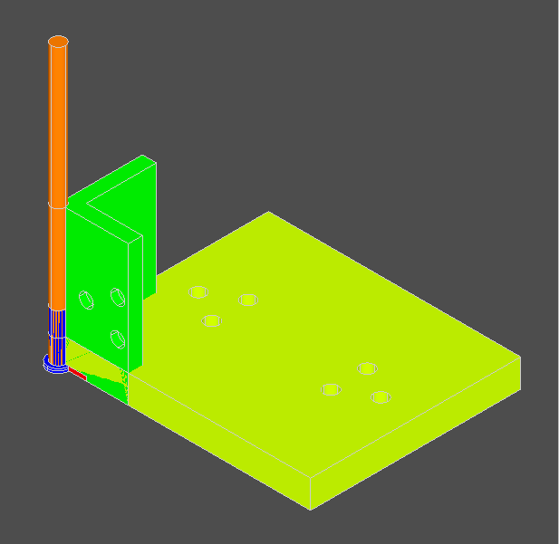
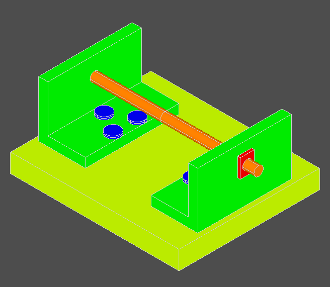
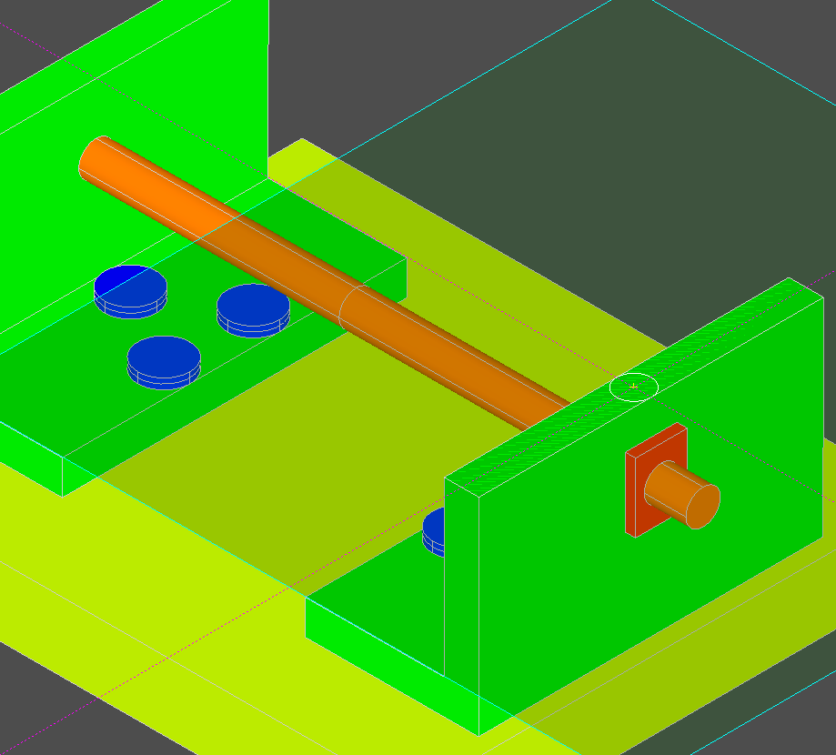
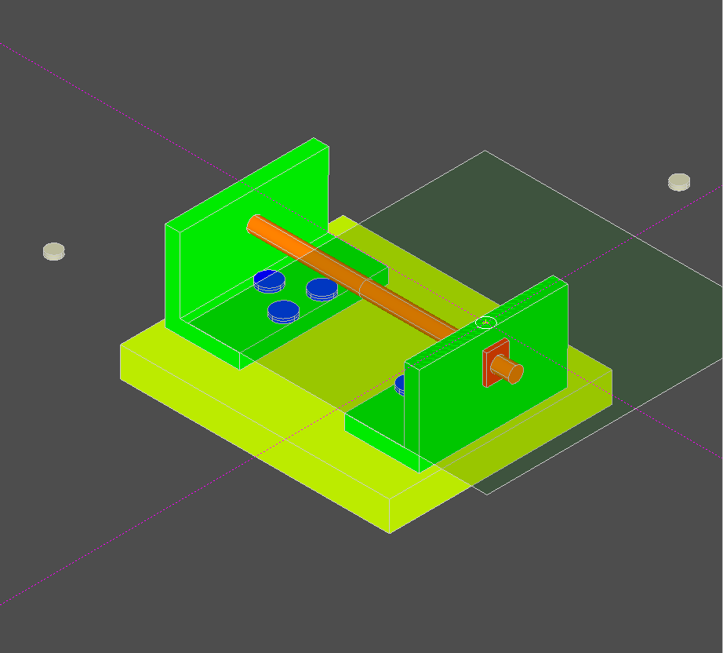

# Working with an OCAF document

* We will use the file `as-ooc-214.stp` as an example in this discussion

### If the file is loaded as **component** (without any assembly structure)
* Use `File -> Load STEP Component` option



* We see these five **prototype shapes** located in a pile, right where they were created:
* Only the 5 simple shapes can be seen in the display, not the assemblies

```
  Entry  | Name
[0:1:1:1] Top
[0:1:1:2] as1
[0:1:1:3] rod-assembly
[0:1:1:4] nut
[0:1:1:5] rod
[0:1:1:6] l-bracket-assembly
[0:1:1:7] nut-bolt-assembly
[0:1:1:8] bolt
[0:1:1:9] l-bracket
[0:1:1:10] plate
```
* Clicking on `Utility -> dump doc` shows the cad model document:
```
Assembly structure of doc:

0:1:1:1.0	[0:1:1:1] Top	Number of labels at root = 6
0:1:1:1:1.0		[0:1:1:1:1] nut => [0:1:1:2] SOLID
0:1:1:1:2.0		[0:1:1:1:2] rod => [0:1:1:3] SOLID
0:1:1:1:3.0		[0:1:1:1:3] bolt => [0:1:1:4] SOLID
0:1:1:1:4.0		[0:1:1:1:4] l-bracket => [0:1:1:5] SOLID
0:1:1:1:5.0		[0:1:1:1:5] plate => [0:1:1:6] SOLID
```

## The same file, loaded with its assembly structure is much more useful:

* Use `File -> Load STEP At Top` option.
* Below is the Kodacad `document dump` immediately after loading this file in **under** TOP.
    * The left column are UID values, needed by Kodacad to identify and differentiate between multiple shared instances of CAD components.
        * UID's are comprised of OCAF label `entries` (':' separated integers) with an appended '.' and trailing integer (used to distinguish between multiple instances of the same part or assembly).
* To the right, the **entry** and **name** of component labels are shown, followed by **=>** and the **entry** and **name** of the **referred label**.
    * The referred label contains the actual CAD shape or assembly data, of which the component is an instance.
    * The level of indentation shows the depth of the parent / child relationship in the tree structure.

```
Assembly structure of doc:

0:1:1:1.0	[0:1:1:1] Top	Number of labels at root = 10
0:1:1:1:1.0		[0:1:1:1:1] as1-oc-214 => [0:1:1:2] as1
0:1:1:2:1.0			[0:1:1:2:1] rod-assembly_1 => [0:1:1:3] rod-assembly
0:1:1:3:1.0				[0:1:1:3:1] nut_1 => [0:1:1:4] nut
0:1:1:3:2.0				[0:1:1:3:2] nut_2 => [0:1:1:4] nut
0:1:1:3:3.0				[0:1:1:3:3] rod_1 => [0:1:1:5] rod
0:1:1:2:2.0			[0:1:1:2:2] l-bracket-assembly_1 => [0:1:1:6] l-bracket-assembly
0:1:1:6:1.0				[0:1:1:6:1] nut-bolt-assembly_1 => [0:1:1:7] nut-bolt-assembly
0:1:1:7:1.0					[0:1:1:7:1] bolt_1 => [0:1:1:8] bolt
0:1:1:7:2.0					[0:1:1:7:2] nut_3 => [0:1:1:4] nut
0:1:1:6:2.0				[0:1:1:6:2] nut-bolt-assembly_2 => [0:1:1:7] nut-bolt-assembly
0:1:1:7:1.1					[0:1:1:7:1] bolt_1 => [0:1:1:8] bolt
0:1:1:7:2.1					[0:1:1:7:2] nut_3 => [0:1:1:4] nut
0:1:1:6:3.0				[0:1:1:6:3] nut-bolt-assembly_3 => [0:1:1:7] nut-bolt-assembly
0:1:1:7:1.2					[0:1:1:7:1] bolt_1 => [0:1:1:8] bolt
0:1:1:7:2.2					[0:1:1:7:2] nut_3 => [0:1:1:4] nut
0:1:1:6:4.0				[0:1:1:6:4] l-bracket_1 => [0:1:1:9] l-bracket
0:1:1:2:3.0			[0:1:1:2:3] plate_1 => [0:1:1:10] plate
0:1:1:2:4.0			[0:1:1:2:4] l-bracket-assembly_2 => [0:1:1:6] l-bracket-assembly
0:1:1:6:1.1				[0:1:1:6:1] nut-bolt-assembly_1 => [0:1:1:7] nut-bolt-assembly
0:1:1:7:1.3					[0:1:1:7:1] bolt_1 => [0:1:1:8] bolt
0:1:1:7:2.3					[0:1:1:7:2] nut_3 => [0:1:1:4] nut
0:1:1:6:2.1				[0:1:1:6:2] nut-bolt-assembly_2 => [0:1:1:7] nut-bolt-assembly
0:1:1:7:1.4					[0:1:1:7:1] bolt_1 => [0:1:1:8] bolt
0:1:1:7:2.4					[0:1:1:7:2] nut_3 => [0:1:1:4] nut
0:1:1:6:3.1				[0:1:1:6:3] nut-bolt-assembly_3 => [0:1:1:7] nut-bolt-assembly
0:1:1:7:1.5					[0:1:1:7:1] bolt_1 => [0:1:1:8] bolt
0:1:1:7:2.5					[0:1:1:7:2] nut_3 => [0:1:1:4] nut
0:1:1:6:4.1				[0:1:1:6:4] l-bracket_1 => [0:1:1:9] l-bracket
```
* By always loading component step files in **Under TOP**, the root label (TOP) is preserved as the **top-level assembly** which contains all the various other subassemblies and parts comprising the entire project.
* When we want to save / load our our entire document to file, use save/load **At TOP**.
    * `Save all at TOP`would be used to save project to file.
    * `Load STEP at TOP` would be used to reload the project from file.
        
## How assembly structure is represented in an OCAF (or XCAF) document
* When a STEP file is read in, it is parsed and then organized into a hierarchical tree structure in which each leaf of the tree (called a **label**) contains CAD data for a particular component, and also contains a unique **entry** to keep track of its place in the tree structure.
* Each and every **unique component** (part or assembly) is a **located instance** of a **prototype shape** attached to a label which is a "sibling" of the root label (TOP assembly).

* In our example, there are 10 labels at root. As mentioned above, CAD data are attached  to these labels as attributes.
* The data for 5 of these labels are parts (TopoDS_shapes) and the other 5 are assemblies.
* Each of these labels has an **entry** of depth=4.

### The hierarchical assembly structure is represented with labels having depth=5

* Our method of exploration will be to drill down, depth first, into the first label at root.
    * In this particular step file, this is the only **Free Shape**.
    * As we will soon see, all the other shapes at root will be accessed by reference from componenet labels
    * Each successive row of the document discovers a component of the parent assembly above.
* For example, the top assembly `[0:1:1:1] Top` (depth=4) has exactly 1 component (1 child label) named `as1-oc-214` whose entry is composed of its parent's entry plus its own tag (:1) appended `[0:1:1:1:1]`.
* In the 2nd row of our doc dump example, you can see that `as1-oc-214` is shown 'referring to' assembly `as1`. This means that `as1-oc-214` is an instance of the assembly `as1`. In this case, it's the **only** instance.
    * Notice that `[0:1:1:1:1] as1-oc-214` has no children.
    * However, its referred label `[0:1:1:2] as1` does have children.
    * Only siblings of the root label (depth=4) have child labels.
* In the third row of the doc dump, we drill down into `[0:1:1:2] as1`, looking for its children.
    * `[0:1:1:2:1] rod-assembly_1` is found to be the first child of `[0:1:1:2] as1`
    * `[0:1:1:2:1] rod-assembly_1` refers to `[0:1:1:3] rod-assembly`
* On the 4th, 5th, and 6th rows, we drill into `[0:1:1:3] rod-assembly` looking for its children, but find only parts, no assemblies. So we have drilled as deep as we can go.
* On the 7th row, we find the 2nd component of `[0:1:1:2] as1` to be `[0:1:1:2:2] l-bracket-assembly_1`
* ... And so on ... Eventually, we will have visisted all the labels at root.

### Location data are stored on component labels

* Components of an assembly are, by definition, instances referring to a root label representing either a simple shape (part) or a compound shape (assembly), but which are usually positioned somewhere else.
* Components get their shape information from their referred shape but they also carry a location vector specifing where their referred shape or assembly is to be located.
* When parsing our STEP file, we need to keep track of the location vectors of each component with respect to its referred shape.
* Let's look at the 2 instances of `[0:1:1:6] l-bracket-assembly` for example.
    * `[0:1:1:2:2] l-bracket-assembly_1` and `[0:1:1:2:4] l-bracket-assembly_2` are very clearly identical instances with different locations.
    * They each have a different location with respect to their parent `[0:1:1:2] as1`.
    * But their parent `[0:1:1:2] as1` will also have a location w/r/t its parent `[0:1:1:1] Top`.
    * Both of these location vectors must be applied, in sequence, to show the instances in their correct locations.

### Add a new component to one of the 2 L-bracket-assemblies

* A picture is worth a thousand words. Let's construct a small 'Button' component and add it to `[0:1:1:2:2] l-bracket-assembly_2`.
    * First, we set `l-bracket-assembly_2` active
    * Create a workplane on the top face of the bracket
    * Draw a 5 mm diameter circle
* 
    * Then extrude the circle 3 mm high to create the new component.
* 
* Not surprisingly, both L-bracket assemblies get the new button, since they are shared instances.
* But a user of this CAD would probably be annoyed when the button shows up somewhere other than where it was intended to be!
* Apparently, by virtue of being hierarchically contained within the assembly `[0:1:1:2:2] l-bracket-assembly_2`, the button component is having its postion transformed by the location vector of its containing assembly. 
    * In ordeer to fix this, when we create a new component, we need to apply the reverse transform of the containing assembly, allowing the component to stay where we want it.

